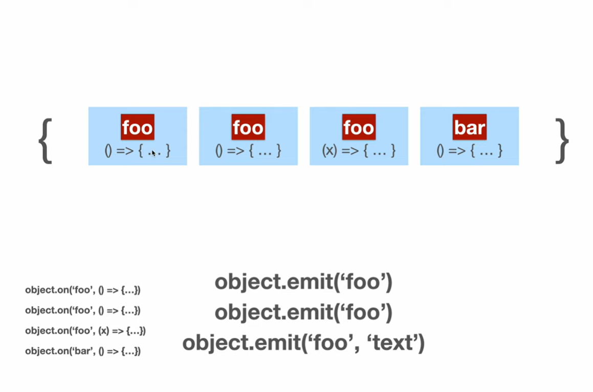

### Event Emitter

#### Creation

1. Import.
```js
const EventEmitter = require('events')
```

2. Creating a event emitter.
```js
const myEmitter = new EventEmitter()
```

3. Registering a event (multiple callbacks can be registered to the same event)
```js
myEmitter.on('hehe', (data) => {
    /**
     * hehe -> is the event name
     * data -> is optional which can be passed when emitting event
     */
    console.log('Event occurred with data:', data)
})
```

4. An event can also be configured so its called only once.
```js
myEmitter.once('bar', () => {
    console.log('bar occurred');
})

myEmitter.emit('bar')
myEmitter.emit('bar') // this will have no effect
```

5. Emitting an event.
```js
myEmitter.emit('hehe', {bing: "chilling"})
```

#### Working



- In simple terms a EventEmitter is an object which maps the event name to a array of callbacks.
- In *step 3* when we register a new callback to a emitter, it saves the event as a key to a value of array which holds the callback.
```
[myEmitter]{
    'hehe': [callback1, callback2....]
    'foo: [cb3, cb4]
}
```

- When a event is "emitted", then **all the callbacks in the array associated to it are called** and are passed a value if given.

